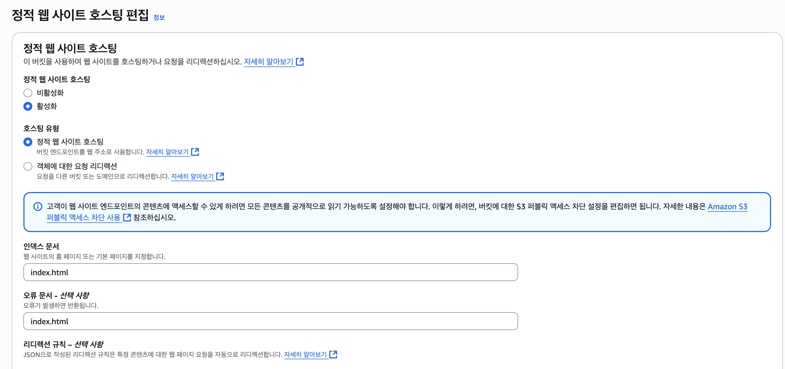
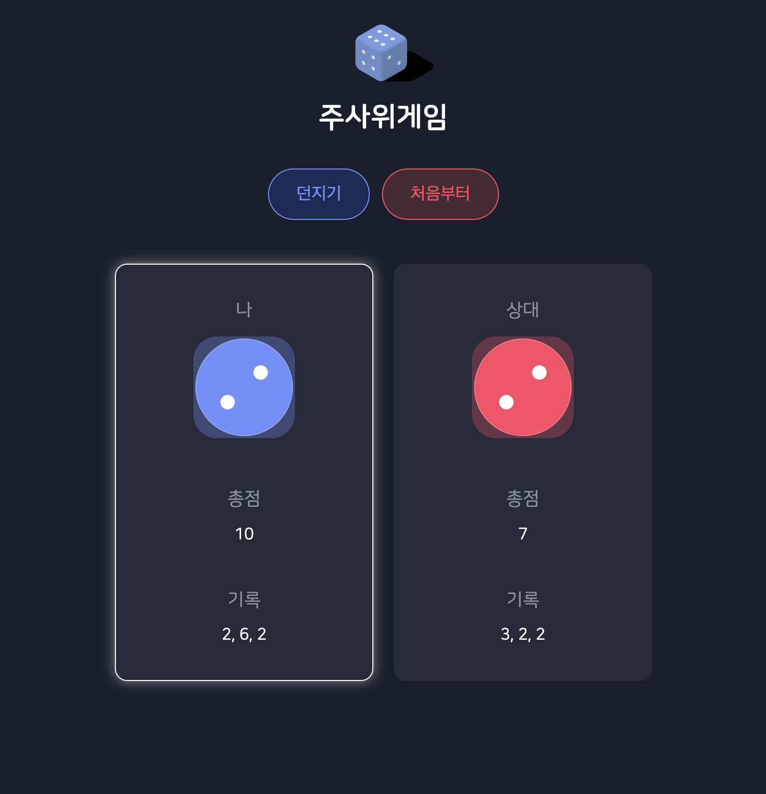

## 1. 프로젝트 구조
폴더 구조는 다음과 같다.
```directory
dicegame/
  build/
  node_modules/
  public/
    index.html
  src/
    assets/
      dice-blue-1.svg
      dice-red-1.svg
      ...
      logo.png
    App.js
    Board.js
    ...
  package.json
```
- assets 폴더에 주사위 이미지와 로고 파일을 넣고 컴포넌트별로 JS와 CSS 파일을 분리했다.

## 2. React 앱 빌드
로컬에서 개발을 마친 뒤, 아래 명령어로 정적 파일을 만든다.
build 폴더에 index.html, JS, CSS 번들 파일이 생성된다.
이 폴더가 S3에 업로드할 대상이다.
- 위의 과정들이 점진적으로 진행되며, 사용자 경험을 위해 HTML 파싱을 기다리지 않고 배치와 그리기 과정을 진행한다.
- 전송을 기다리는 동시에 받은 내용의 일부를 먼저 화면에 표시한다.

## 3. AWS S3 버킷 생성 및 설정
S3 콘솔에서 새 버킷을 만든다.
정적 웹사이트 호스팅을 활성화한다.

기본 문서로 index.html을 지정한다.

## 4. 퍼블릭 접근 권한 설정
버킷 정책을 추가해 모든 사용자가 파일을 읽을 수 있게 한다.
예시 정책:
```json
{
  "Version": "2012-10-17",
  "Statement": [
    {
      "Sid": "PublicReadGetObject",
      "Effect": "Allow",
      "Principal": "*",
      "Action": "s3:GetObject",
      "Resource": "arn:aws:s3:::버킷명/*"
    }
  ]
}
```
정책을 적용하지 않으면 외부에서 접속이 불가능하다.

## 5. 파일 업로드
build 폴더의 모든 파일을 S3 버킷에 업로드한다.
폴더 구조가 깨지지 않게 전체 파일을 선택해 올린다.

## 6. 배포 결과 및 주의사항
S3 웹사이트 엔드포인트로 접속하면 React 주사위 게임이 동작한다.

index.html이 반드시 build 폴더에 있어야 한다.
경로가 잘못되면 "NoSuchKey" 오류가 발생한다.
정적 파일 경로는 상대경로로 설정해야 한다.
이미지, JS, CSS 파일이 정상적으로 로드되는지 확인한다.

## 7. 마무리
S3를 사용하면 별도의 서버 없이 React 앱을 배포할 수 있다.
폴더 구조와 빌드 결과물을 정확히 관리해야 한다.
실제 배포 과정에서 경로, 권한, 캐시 문제에 주의해야 한다.