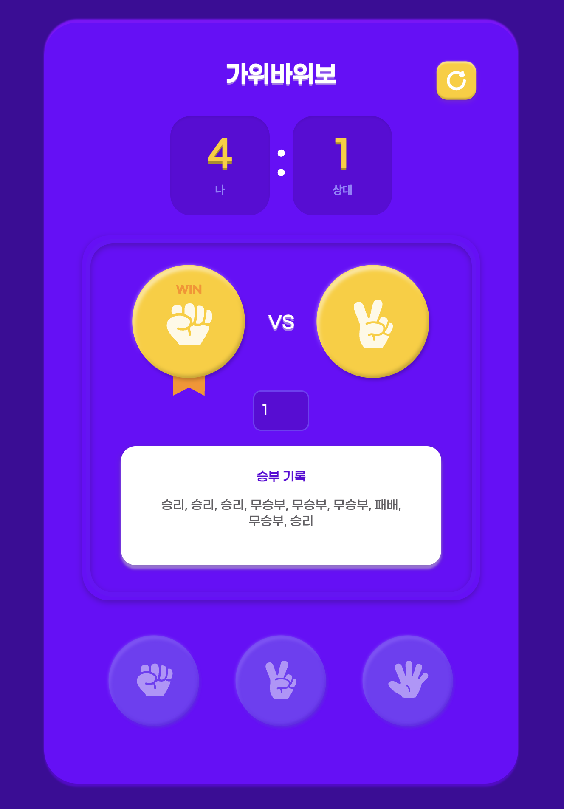

## 1. 프로젝트 소개
가위바위보 게임을 React로 구현했습니다. 사용자는 가위, 바위, 보 중 하나를 선택하고, 컴퓨터와 대결하여 승패를 기록합니다. 점수판, 베팅 기능, 승패에 따라 이미지와 스타일이 바뀌는 UI를 제공합니다.

- 사용 기술: React 19, CSS
- 주요 폴더 구조: src/에 컴포넌트와 유틸 함수 분리

## 2. 주요 기능
- 가위/바위/보 선택: HandButton 컴포넌트로 구현, 클릭 시 내 선택이 반영됨
- 랜덤 상대: 컴퓨터의 선택은 generateRandomHand 함수로 무작위 결정
- 점수판: Score 컴포넌트로 나와 상대의 점수를 실시간 표시
- 베팅 기능: input으로 베팅 점수 조절, 1~9 사이 값만 허용
- 승패 기록: 게임 결과가 배열로 저장되어 화면에 표시됨
- 이미지/스타일 변화: 승리/패배/무승부에 따라 손 이미지와 배경 스타일이 변경됨

## 3. 구현 과정
1. 컴포넌트 설계
- App.js: 전체 상태 관리 및 UI 배치
- HandIcon.js: 손 모양 이미지와 승패에 따른 스타일 적용
- HandButton.js: 선택 버튼 UI
- Score.js: 점수판 UI

2. 상태 관리
- useState로 내 손, 상대 손, 점수, 베팅, 게임 기록 등 관리
- handleButtonClick에서 게임 진행 및 상태 업데이트

3. 승패 판정 로직
- compareHand 함수로 승패 계산
- getResult 함수로 결과 문자열 반환(‘승리’, ‘패배’, ‘무승부’)

4. UI/UX 개선
- 승패에 따라 Hand 컴포넌트에 winner/loser/draw 클래스 추가
- CSS에서 각 승리시 배경 이미지 다르게 적용
- 베팅 입력값 제한(1~9)으로 UX 향상

## 4. 배운 점 & 느낀 점
1. React의 컴포넌트 설계와 상태 관리
- 여러 개의 컴포넌트를 분리해서 개발하니 코드의 재사용성과 유지보수성이 크게 향상됨을 느꼈다.
- useState를 활용해 각종 상태(손 선택, 점수, 베팅, 기록 등)를 관리하면서 React의 데이터 흐름을 더 깊이 이해할 수 있었다. 

2. 동적 UI와 CSS 활용
- 승패에 따라 이미지와 배경 스타일을 동적으로 바꾸는 작업을 하면서, CSS 클래스와 조건부 렌더링의 중요성을 체감했다.
- CSS에서 클래스 조합으로 다양한 효과를 줄 수 있다는 점이 재미있었고, 사용자 경험을 높이는 데 큰 역할을 한다는 것을 배웠다.

3. 사용자 경험(UX) 개선의 중요성
- 베팅 입력값을 1~9로 제한하거나, 승패 기록을 시각적으로 잘 보여주는 등 작은 부분까지 신경 쓰는 것이 UX에 큰 영향을 준다는 것을 알게 되었다.
- 초기화 버튼, 점수판, 기록 등 부가적인 UI 요소가 게임의 완성도를 높여준다는 점을 느꼈다.

## 5. 마무리 및 배포
배포 링크: [링크](http://rock-scissor-paper.react.seony.s3-website.ap-northeast-2.amazonaws.com/)
- 배포는 주사위게임 AWS S3 정적 웹사이트 배포 과정과 동일하게 진행
- 관련 링크: [주사위게임 S3 배포 과정](./2025-09-02-주사위-게임-s3-배포.md)